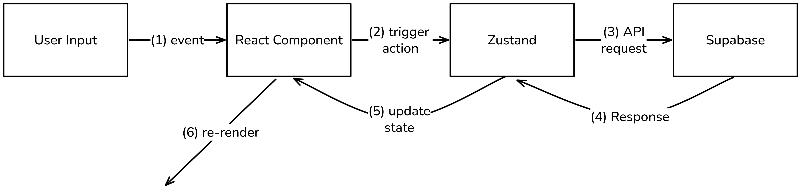

# 🎮 Baskin Day TypeRacer

A full-stack typing game inspired by TypeRacer, built for UCSC’s Baskin Day event. Used by 70+ students.

---

## ⚙️ Tech Stack

**Frontend:** React, CSS, Zustand  
**Backend:** Supabase
**Deployment:** Vercel

---

## 🚀 Features

- ⚡ Real-time WPM & accuracy tracking
- 🔁 Interval-based game loop with auto race end
- 🧠 Zustand-powered global game state
- 🗄️ Supabase-backed scoring + player data

---

## 🧩 Architecture



**(1)** User → React
User types or clicks; React components capture the event.

**(2)** React → Zustand
Components call store actions to update local state or trigger async work.

**(3)** Zustand → Supabase
Store sends any required fetch/insert requests to Supabase.

**(4)** Supabase → Zustand
Supabase returns data, and the store updates itself accordingly.

**(5)** Zustand → React
Subscribed React components automatically re-render.

**(6)** React → UI
The updated UI is shown to the user (new WPM, leaderboard, etc.).

---

## ▶️ Run Locally

```bash
git clone https://github.com/yourusername/BaskinDay-TypeRacer.git
npm install
npm run dev
```
